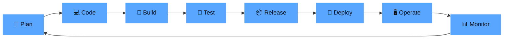

<!-- Header Banner -->
<div align="center">
  
</div>

<!-- Greeting & Introduction -->
<div align="center">
  
  # Hey there! I'm [Your Name] 👋
  
  <a href="https://linkedin.com/in/yourprofile">
    
  </a>
  <a href="mailto:your.email@gmail.com">
    
  </a>
  <a href="https://your-portfolio.dev">
    
  </a>
  <a href="https://dev.to/yourprofile">
    
  </a>

  <br/><br/>

  

</div>

<br/>

<!-- About Me -->
## 🧑‍💻 About Me

```yaml
apiVersion: v1
kind: DevOpsEngineer
metadata:
  name: "Your Name"
  location: "Ho Chi Minh City, Vietnam 🇻🇳"
  role: "DevOps Engineer"
spec:
  education:
    - degree: "Bachelor of Information Technology"
      university: "Your University"
  currentFocus:
    - "Cloud-Native Architecture & Microservices"
    - "GitOps & Infrastructure as Code"
    - "Platform Engineering"
  funFact: "I automate everything — even my coffee machine ☕"
  motto: "If you have to do it twice, automate it."
```

<br/>

<!-- Tech Stack -->
## 🛠️ Tech Stack & Tools

<div align="center">

### ☁️ Cloud Platforms
<p>
  
  
  
  
</p>

### 🐳 Containers & Orchestration
<p>
  
  
  
  
  
</p>

### 🏗️ Infrastructure as Code
<p>
  
  
  
  
</p>

### 🔄 CI/CD
<p>
  
  
  
  
</p>

### 📊 Monitoring & Observability
<p>
  
  
  
  
  
</p>

### 💻 Languages & Scripting
<p>
  
  
  
  
  
</p>

### 🗄️ Databases & Messaging
<p>
  
  
  
  
  
  
</p>

### 🔧 Other Tools
<p>
  
  
  
  
  
  
</p>

</div>

<br/>

<!-- Architecture Diagram -->
## 🏛️ What I Build

```
                        ┌─────────────────────────────────────────────┐
                        │              Production Traffic              │
                        └────────────────────┬────────────────────────┘
                                             │
                                      ┌──────▼──────┐
                                      │   CDN/WAF   │
                                      │ CloudFlare  │
                                      └──────┬──────┘
                                             │
                                   ┌─────────▼─────────┐
                                   │   Load Balancer    │
                                   │   (Nginx/ALB)      │
                                   └─────────┬─────────┘
                                             │
                        ┌────────────────────┼────────────────────┐
                        │                    │                    │
                  ┌─────▼─────┐       ┌──────▼─────┐      ┌─────▼─────┐
                  │  Service  │       │  Service   │      │  Service  │
                  │    Pod    │       │    Pod     │      │    Pod    │
                  │  (K8s)   │       │   (K8s)    │      │  (K8s)   │
                  └─────┬─────┘       └──────┬─────┘      └─────┬─────┘
                        │                    │                   │
                        └────────────────────┼───────────────────┘
                                             │
                  ┌──────────────────────────┼──────────────────────────┐
                  │                          │                          │
           ┌──────▼──────┐          ┌────────▼────────┐        ┌───────▼───────┐
           │  Database   │          │   Cache Layer   │        │  Message Bus  │
           │ PostgreSQL  │          │     Redis       │        │    Kafka      │
           └─────────────┘          └─────────────────┘        └───────────────┘

    🔄 CI/CD: GitHub Actions → ArgoCD → K8s
    📊 Monitoring: Prometheus + Grafana + Loki
    🔐 Security: Vault + Trivy + SonarQube
    🏗️ IaC: Terraform + Ansible
```

<br/>

<!-- GitHub Stats -->
## 📈 GitHub Stats

<div align="center">
  
  
</div>

<div align="center">
  
</div>

<div align="center">
  
</div>

<br/>

<!-- Certifications -->
## 🎓 Certifications

<div align="center">
  <table>
    <tr>
      <td align="center" width="200">
        <br/>
        <sub><b>AWS Solutions Architect</b></sub>
      </td>
      <td align="center" width="200">
        <br/>
        <sub><b>Certified Kubernetes Admin</b></sub>
      </td>
      <td align="center" width="200">
        <br/>
        <sub><b>Terraform Associate</b></sub>
      </td>
    </tr>
  </table>
  
  <sub>💡 <i>Thêm hoặc bớt certifications tùy theo những chứng chỉ bạn có</i></sub>
</div>

<br/>

<!-- Featured Projects -->
## 🚀 Featured Projects

<div align="center">
  <a href="https://github.com/yourusername/project1">
    
  </a>
  <a href="https://github.com/yourusername/project2">
    
  </a>
</div>

<div align="center">
  <a href="https://github.com/yourusername/project3">
    
  </a>
  <a href="https://github.com/yourusername/project4">
    
  </a>
</div>

<br/>

<!-- DevOps Pipeline -->
## 🔄 My DevOps Philosophy

<div align="center">



</div>

> *"Automate what can be automated, monitor what cannot, and document everything."*

<br/>

<!-- Latest Blog Posts -->
## 📝 Latest Blog Posts

<!-- BLOG-POST-LIST:START -->
- 🔧 [How I Built a Production-Ready K8s Cluster from Scratch](#)
- 🐳 [Docker Best Practices for Production Workloads](#)
- 🏗️ [Terraform Modules: A Clean Architecture Approach](#)
- 📊 [Monitoring Microservices with Prometheus & Grafana](#)
- 🔐 [Secrets Management with HashiCorp Vault on Kubernetes](#)
<!-- BLOG-POST-LIST:END -->

<br/>

<!-- Contribution Snake -->
## 🐍 Contribution Graph

<div align="center">
  <picture>
    <source media="(prefers-color-scheme: dark)" srcset="https://raw.githubusercontent.com/yourusername/yourusername/output/github-snake-dark.svg" />
    <source media="(prefers-color-scheme: light)" srcset="https://raw.githubusercontent.com/yourusername/yourusername/output/github-snake.svg" />
    
  </picture>
</div>

<br/>

<!-- Profile Views & Trophies -->
<div align="center">
  
</div>

<br/>

<!-- Connect -->
## 🤝 Let's Connect

<div align="center">
  <p>I'm always interested in collaborating on DevOps projects, open-source contributions, and knowledge sharing.</p>
  
  <a href="https://linkedin.com/in/yourprofile">
    
  </a>
  <a href="mailto:your.email@gmail.com">
    
  </a>
  <a href="https://t.me/yourusername">
    
  </a>
</div>

<br/>

<div align="center">
  
</div>

<!-- Footer -->
<div align="center">
  
</div>
